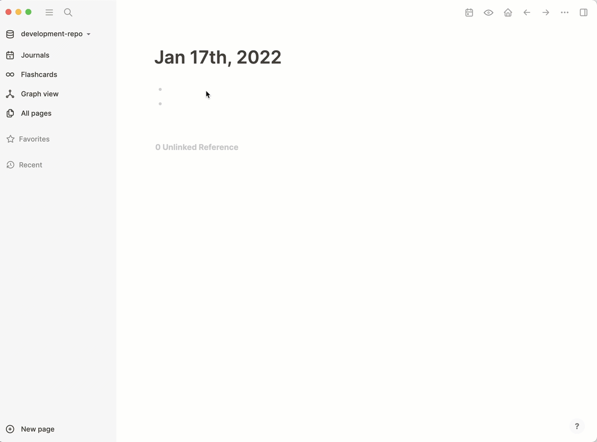

## Logseq Things 3 Plugin (ALPHA)


Import completed items into Journal Page




## Setup

Logseq sandboxes plugins preventing them from accessing the file system and thus the Things 3 database.  As a workaround, I have also developed a companion app that exposes the Things 3 database
via http server.  

https://github.com/kurtharriger/logseq-things3-query-proxy


## Notes and potential roadmap 

- More properties.  Include project, area, start end date, notes and checklists and thigns url for linking to task in things.

- Group task by area and project

- Auto link pages that are mentioned in notes or checklists

- Sync logbook as global task instead of slash command automatically updating and/or creating journal pages as necessary.

- Improve proxy app to run as system tray rather than in terminal

- Improve proxy to support subscriptions and push updates in real time

- Explore storing block uuid in external metadata instead of embedding uuid in task properties

- Import open tasks (upates in logseq would be overwritten). 

- Explore using apple script to provide bi-directional sync of changes via proxy. See https://culturedcode.com/things/download/Things3AppleScriptGuide.pdf


## Questions 

- Can the uuids and other properties be collapsed or hidden? Potentially could move uuid to child block so that it can be collapsed, but this makes it more difficult to find the tasks in queries since the property would be on child task. Potentially can store block id in external metadata instead of things 3 properties, but I'm not entirely sure how things ensures uuids remain stable if you want to move a task.  


## Develop

``` shell
yarn
yarn watch
# Enable developer mode in Logseq
# Click "Load unpacked plugin" to open this folder
# Click the "Reload" button to refresh latest changes
```


### Connect to the repl

Check https://shadow-cljs.github.io/docs/UsersGuide.html#cider.

## Release

``` shell
yarn release
```
